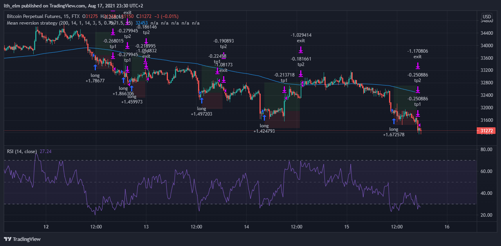
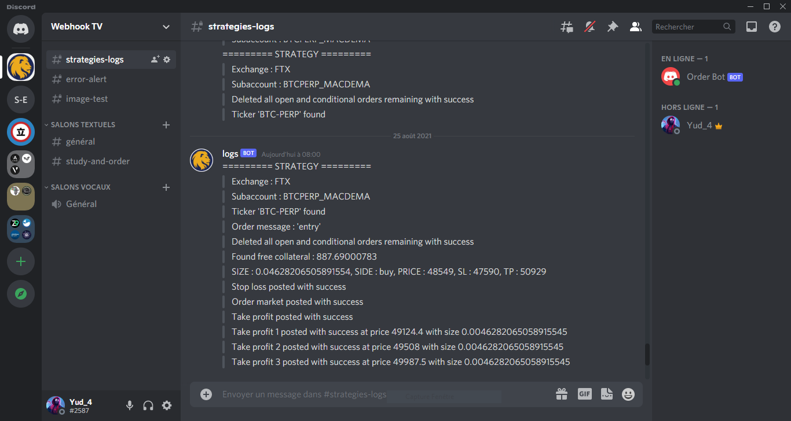
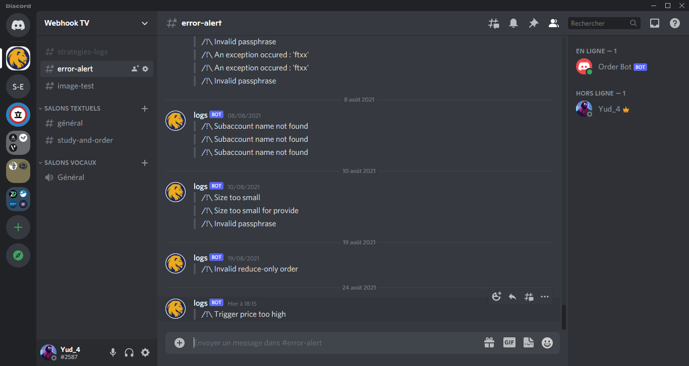
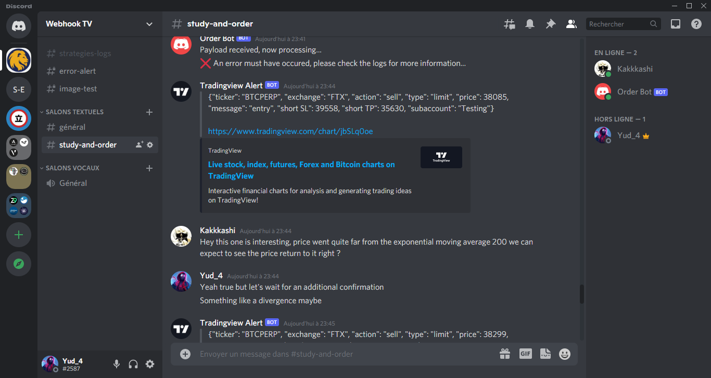
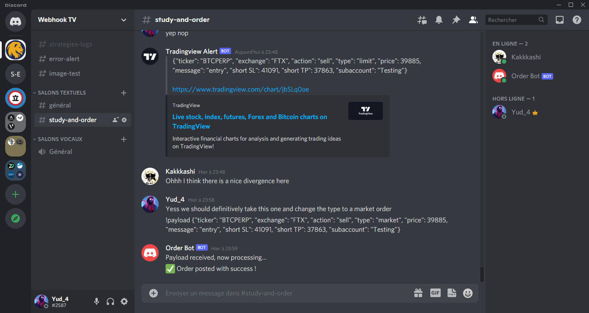

# Trade Order Webhook

## Presentation
A Flask app receiving alerts from TradingView and automatically sending a POST order to an integrated exchange API such as ByBit (Binance to come). It can also deliver the alert and the chart to Discord, where you can decide whether or not to take that trade through a Discord bot.

In order to build this app, I relied on two great videos to get started, implementing and deploying basic stuff. I then enhanced it for my own use. You can watch the video from Part Time Larry [here](https://www.youtube.com/watch?v=XPTb3adEQEE) and the video on creating a Discord bot from freeCodeCamp.org [here](https://www.youtube.com/watch?v=SPTfmiYiuok).

This readme provides a high-level overview of the project. For more technical details, you may refer to the original documentation.

## TradingView
First of all, to use TradingView webhooks, you'll need to subscribe to the Pro Plan (approximately $12 per month with a free month trial available) or Free Plan for one alert only. You can subscribe to the Pro Plan with 50% discount (approximately $299 per year) in Black Friday day per year.

### Pinescript Strategy & Alerts
It available for both Strategy & Indicator Alerts. Config your alert like as below:
Add your service domain to TradingView Alert in ```Notifications -> Webhook URL```

You can view a example json in [here](alertmodel.txt)
```
{
    "ticker": {{ticker}},
    "exchange": {{exchange}},
    "action": {{strategy.order.action}},
    "price": {{strategy.order.price}},
    "message": {{strategy.order.alert_message}},
    "short SL": {{plot("Short SL")}},
    "short TP": {{plot("Short TP")}},
    "long SL": {{plot("Long SL")}},
    "long TP": {{plot("Long TP")},
    "passphrase": "abcdefg",
    "subaccount": "test3python"
}
```
[This is a example strategy script](./pinestrategies/Quick-Mean-Reversion-Strat.pine)



### Trading Bot
The trading bot is responsible for handling incoming TradingView alerts and interacting with exchange APIs to place orders. It has different components, including the main app, routes, and password handling, order initialization, and the exchange API integration.

```
[POST]
https://<domain>/tradingview-to-webhook-order
```

#### Main app, Routes, and Password
The Flask app defines routes for handling incoming TradingView alerts. It verifies the passphrase in the payload to ensure the authenticity of the request. If the passphrase is valid, it calls the `order()` function to execute the order.

```python
import logbot

if 'passphrase' not in data.keys():
    logbot.logs(">>> /!\ No passphrase entered", True)
    return {
        "success": False,
        "message": "no passphrase entered"
    }

if data['passphrase'] != webhook_passphrase:
    logbot.logs(">>> /!\ Invalid passphrase", True)
    return {
        "success": False,
        "message": "invalid passphrase"
    }

orders = order(data)
return orders
```

#### Order Initialization
The order initialization process involves setting global variables such as subaccount, leverage, maximum risk per trade, API key, and API secret. It also defines the exchange and tickers used in the order. The order function calculates the position size based on risk and enters, exits, or sets breakeven levels for trades.

```python
import os

subaccount_name = payload['subaccount']
if subaccount_name == 'Testing':
    risk = os.environ.get('RISK_TESTING', config.RISK_TESTING)
    risk = float(risk) / 100
    # ...
elif subaccount_name == 'STRATEGY_TWO':
# ...
```

#### Exchange API
This project integrates with exchange APIs to execute orders. The example includes FTX integration. The methods for placing orders are defined in the exchange API classes. You may need to adapt these methods for other exchanges.

Each exchange provides a testnet account for development and testing purposes, and it is free of charge.

Bybit Exchange:
- [Bybit Testnet](https://testnet.bybit.com/)

- [Python Pybit](https://pypi.org/project/pybit/)

### Good to Know
#### Config variables in local
To run the application locally, you need to update all instances where the `ENV` variables are used with the appropriate method. This is because on the server, the variables are not fetched from the `config_example.py` file. 
```
# From
webhook_passphrase = os.environ['WEBHOOK_PASSPHRASE']
# To
webhook_passphrase = os.environ.get('WEBHOOK_PASSPHRASE', config.WEBHOOK_PASSPHRASE)
```

#### Switch between testnet API and live API
To between testnet API and live API, you just need to modify the `subaccount` in the payload. Ex: test3python, live3python

#### Run Application
```bash
python -m flask run
```

### Discord Logs
The project sends logs to a Discord channel for monitoring and tracking the bot's actions. Logs are sent in case of errors, and an error channel is available for high-priority notifications. The `logbot` Python file is responsible for sending logs to Discord.

```
[POST]
https://<domain>/tradingview-to-discord-study
```


You can create another channel for **error logs** where you would set notifications to high priority so that you will be quickly aware if anything goes wrong.




### Discord Trading Bot
The Discord trading bot allows users to interact with TradingView alerts that are sent to a Discord channel. Users can view charts, receive alert messages, and decide whether to place an order. The bot recognizes specific commands and processes orders with the help of the Flask app.






# Troubleshooting

If you encounter any issues or have trouble with the Webhook TV Trading Bot, consider the following troubleshooting steps:

1. **Verify Your Environment**: Ensure that you have set up your environment variables correctly, including your API keys, passphrase, and other configuration details. Double-check that the bot has the necessary permissions on the Discord server.

2. **Logs and Error Messages**: Pay close attention to the logs and error messages provided by the bot and the Flask application. These messages can help you identify the source of the problem. If you see any error messages, cross-reference them with the documentation to diagnose the issue.

3. **Webhook URLs**: Make sure that your TradingView alerts and Discord bot are using the correct webhook URLs. The URL for TradingView alerts should match the endpoint in your Flask app, and the Discord bot should use the correct channel webhook URLs.

4. **Discord Bot Status**: Ensure that your Discord bot is running and operational. If the bot is not responding, check the Repl.it environment or hosting platform for any potential issues.

5. **Exchange Integration**: If you are having problems with specific exchanges or trading strategies, review the exchange API documentation and ensure that your strategy code and payload structures match the requirements.

6. **Dependencies and Libraries**: Check that you have installed and configured all necessary libraries and dependencies. Verify the versions to avoid compatibility issues.

7. **Community Support**: Reach out to the community or developer forums for assistance. Sometimes, other users may have encountered similar issues and can offer solutions or workarounds.

8. **Customization**: If you have made extensive customizations to the code, ensure that these changes are compatible and correctly implemented. Double-check your modifications against the provided codebase.

9. **Logging and Monitoring**: Implement robust logging and monitoring of your bot and the trading strategy. This will help you identify issues more quickly and improve overall performance.

If you still encounter problems after going through these troubleshooting steps, consider reaching out to the bot's developer or the relevant support channels for assistance.

# Disclaimer

This Webhook TV Trading Bot and the associated documentation are provided for educational and informational purposes only. Trading cryptocurrencies and financial instruments carries inherent risks and may result in significant financial losses. The developer and contributors of this bot are not financial advisors, and the information provided here should not be considered as financial advice.

Before using this trading bot in a live trading environment, it is essential to thoroughly understand the risks and have a clear trading strategy in place. You should conduct your research, seek advice from financial professionals, and use this bot with caution.

By using this bot, you acknowledge that you are solely responsible for your trading decisions and any outcomes that may result from those decisions. The developer and contributors of this bot are not liable for any losses or damages that may occur while using the bot.

Always exercise due diligence, manage risk carefully, and trade responsibly in the volatile cryptocurrency and financial markets.